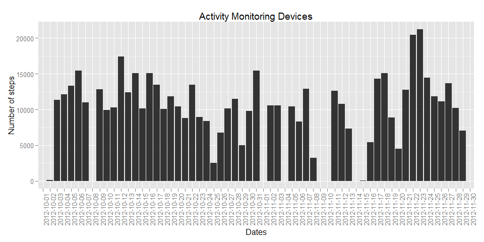
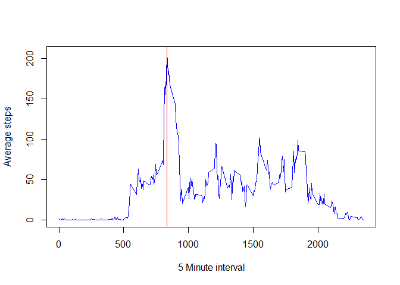
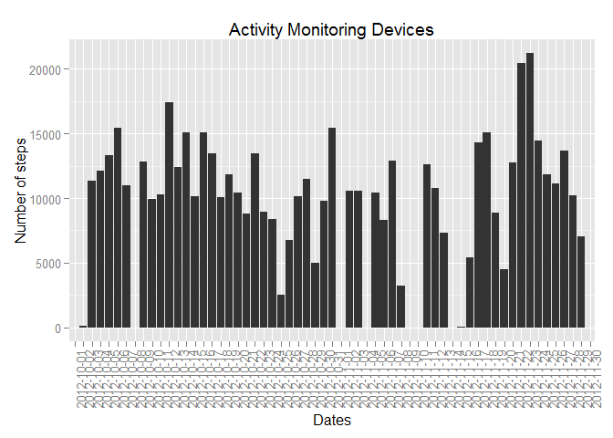
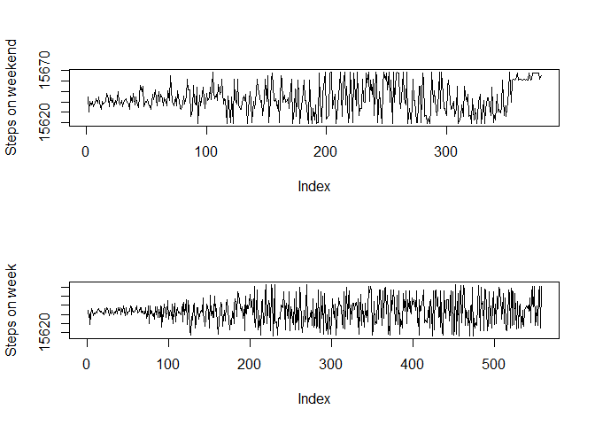

# PA_Assignment1

Loading and preprocessing the data
=================================


```r
setwd("C:/Users/Dan/Documents/project 1/RepData_PeerAssessment1")
data <- read.csv("activity.csv",header = T,stringsAsFactor = F)
data$date <- as.Date(x = data$date, format ="%Y-%m-%d")
```

What is mean total number of steps taken per day?
================================================

```r
library(ggplot2)
steps <- tapply(data$steps,data$date, FUN = sum, na.rm = T)

dataFrame <- data.frame(row.names = seq(1:nrow(steps)))
dataFrame$dates <- rownames(steps)
dataFrame$steps <- as.vector(steps)

mean <- round(x = mean(dataFrame$steps), digits = 2)
median <- median(dataFrame$steps)

ggplot(dataFrame, aes(x=dataFrame$dates, y=dataFrame$steps)) + geom_bar(stat="identity") + theme(axis.text.x = element_text(angle = 90, hjust = 1)) + labs(title = "Activity Monitoring Devices") + labs(y = "Number of steps") + labs(x = "Dates")
```

 

**Mean:** 9354.23

**Median:** 10395

What is the average daily activity pattern?
==========================================

```r
steps<- tapply(data$steps,data$interval, FUN = mean, na.rm = T)

dataFrame <- data.frame(row.names = seq(1:nrow(steps)))
dataFrame$minInterval <- rownames(steps)
dataFrame$avgSteps <- as.vector(steps)

avgMaxStep <- dataFrame$minInterval[which.max(dataFrame$avgSteps)]

plot(x = dataFrame$minInterval, y = dataFrame$avgSteps, type = "l",col="blue", xlab = "5 Minute interval", ylab = "Average steps")
abline(v = avgMaxStep, col = "red")
```

 

The interval **835** contains the max number of steps on average of the 5 minute interval which is 206.17.


Imputing missing values
=======================

The strategy for imputing the data is to replace NAs with ceros.


```r
totalNA <- nrow(data[is.na(data$steps),])
# Introducing ceros in NAs
data2 <- data

data2$steps[is.na(data2$steps)] <- 0

# Confirm imputation was correct
newTotalNA <- nrow(data2[is.na(data2$steps),])

steps <- tapply(data2$steps,data2$date, FUN = sum, na.rm = T)

dataFrame <- data.frame(row.names = seq(1:nrow(steps)))
dataFrame$dates <- rownames(steps)
dataFrame$steps <- as.vector(steps)

mean2 <- round(x = mean(dataFrame$steps), digits = 2)
median2 <- median(dataFrame$steps)

ggplot(dataFrame, aes(x=dataFrame$dates, y=dataFrame$steps)) + geom_bar(stat="identity") + theme(axis.text.x = element_text(angle = 90, hjust = 1)) + labs(title = "Activity Monitoring Devices") + labs(y = "Number of steps") + labs(x = "Dates")
```

 


**Total NAs:** 2304

**Mean:** 9354.23

**Median:** 10395

Nothing happens imputing the data with ceros


Are there differences in activity patterns between weekdays and weekends?
=========================================================================


```r
Sys.setlocale("LC_ALL","English")
```

```
## [1] "LC_COLLATE=English_United States.1252;LC_CTYPE=English_United States.1252;LC_MONETARY=English_United States.1252;LC_NUMERIC=C;LC_TIME=English_United States.1252"
```

```r
whichday <- weekdays(data2$date)


weekendIndx <- which(whichday %in% c("Saturday","Sunday"))
weekdInd <- which(!(whichday %in% c("Saturday","Sunday")))

weekend <- data2[weekendIndx,c("date","steps")]
weekd <- data2[weekdInd,c("date","steps")]


stepsWeekEnd<- tapply(weekend$date,weekend$steps, FUN = mean, na.rm = T)
stepsWeek<- tapply(weekd$date,weekd$steps, FUN = mean, na.rm = T)

par(mfrow = c(2,1))
plot(stepsWeekEnd, type = "l", ylab = "Steps on weekend")
plot(stepsWeek, type = "l", ylab = "Steps on week")
```

 

